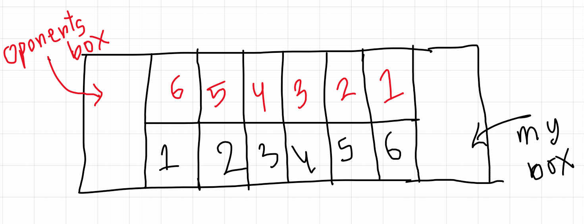

# Mancala-Contest-Kit
Protocol &amp; referee Code for Mancala Game

# Protocol

- Lets say your program is "a.exe" , then The referee will run your program as `./a.exe PLAYER_TURN` , where PLAYER_TURN is either 1 or 2.
- If PLAYER_TURN is 1 then you move first, Other wise you move second.
- If its your turn then you have to print the move in standard output ( printf , cout , print etc).
- You can know your opponent's move by scanning input from standard input ( scanf , cin , input etc).
- When any terminal state is reached throughout the game, you should exit your program.
- You can use any language you want, but you have to follow the protocol.

## Moves:
- In one moves you can print a number between 1 to 6.
- 

# Rules:
- Stones moves in counter-clockwise direction.
- Last stone in my bowl allow me extra turn.
- Last stone in my empty box gather oponents corresponding stones in my bowl , including my that stone.
- Total score = total stones in my bowl + total stones in my row.

## Example:
- AI written in cpp:
  - Preprocess:
	```
		g++ ai.cpp -o ai.out
	```
  - CommandList in refree.py
	```
		["./ai.out"]
	```
- AI written in python:
  - if Shebang (#!/bin/python) is added in the first line of the file
	then CommandList in refree.py
	```
		["./ai.py"]
	```
  - else CommandList in refree.py
	```
		["python", "ai.py"]
	```
- AI written in java:
  - Preprocess:
	```
		javac ai.java
	```
  - CommandList in refree.py
	```
		["java" , "ai"]
	```
	


